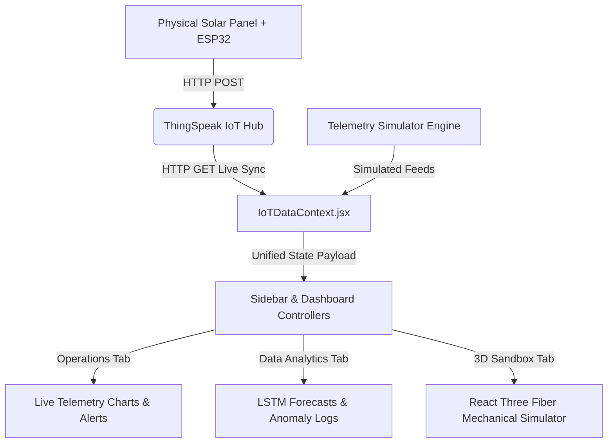

# KIRAN Solar Tracker Dashboard ☀️🔋

An enterprise-grade, high-fidelity SaaS IoT dashboard for monitoring, simulating, and optimizing single-axis active solar trackers. KIRAN integrates real-time IoT feeds, explainable machine learning predictions, and a React Three Fiber 3D simulation sandbox to deliver complete operational visibility.

---

## 🚀 Key Features

*   **Real-Time Telemetry Suite (Operations View)**: Monitors key environmental and electrical parameters:
    *   *Irradiance* ($W/m^2$)
    *   *Temperature* ($°C$)
    *   *Voltage* ($V$)
    *   *Actuator Tracking Azimuth* ($°$)
    *   *Sun Zenith / Elevation Angle* ($°$)
    *   *NIBB Buck-Boost Converter* efficiency, power output ($W$), and cumulative energy generation ($Wh$).
*   **Explainable AI & Machine Learning Diagnostics (Data Analytics)**:
    *   *LSTM Neural Network Predictor*: Short-term solar power forecasting compared against actual output.
    *   *Unsupervised Isolation Forest*: Evaluates multi-variate telemetry streams to flag physical actuator jams or sensor calibration drift in real time.
    *   *BRANN (Bayesian Regularized Artificial Neural Network)*: Handles optimum solar tracking convergence under cloudy or high-scatter sky conditions.
    *   *Yield Multipliers*: Live tracking comparison illustrating energy gains vs standard static fixed-tilt configurations.
*   **3D Sandbox Simulator (3D Sandbox)**:
    *   Built using **React Three Fiber (R3F)** and **Three.js**.
    *   Simulates the mechanical kinematics of a single-axis PV panel tracking the solar vector in real time.
    *   Supports manual override controls for testing panel azimuth, sun zenith, dust/shading levels, and cloud covers.

---

## 🛠️ Tech Stack

*   **Frontend**: React (Vite), JavaScript (ES6+), TailwindCSS (Vanilla utility systems)
*   **Visualizations**: Chart.js (`react-chartjs-2`) with customized dynamic Y-axis scaling for micro-fluctuations.
*   **3D Graphics**: Three.js, `@react-three/fiber`, `@react-three/drei`
*   **State Sync**: React Context API (`IoTDataContext`) for unified simulated/live state distribution.
*   **Data Ingestion Core**: IoT channels powered by ThingSpeak HTTP API polling.

---

## ⚙️ Project Setup

### 1. Prerequisites
Ensure you have [Node.js](https://nodejs.org/) (v18+) installed.

### 2. Environment Configurations
Create a `.env` file in the root directory:
```env
VITE_CHANNEL_ID1=
VITE_CHANNEL_ID2=
VITE_READ_API_KEY1=
VITE_READ_API_KEY2=
```

### 3. Installation & Local Development
```bash
# Install packages
npm install

# Start the dev server
npm run dev
```
Open [http://localhost:5173](http://localhost:5173) in your browser.

### 4. Build for Production
```bash
# Build the optimized production assets
npm run build

# Preview the build locally
npm run preview
```

---

## 📈 System Architecture


